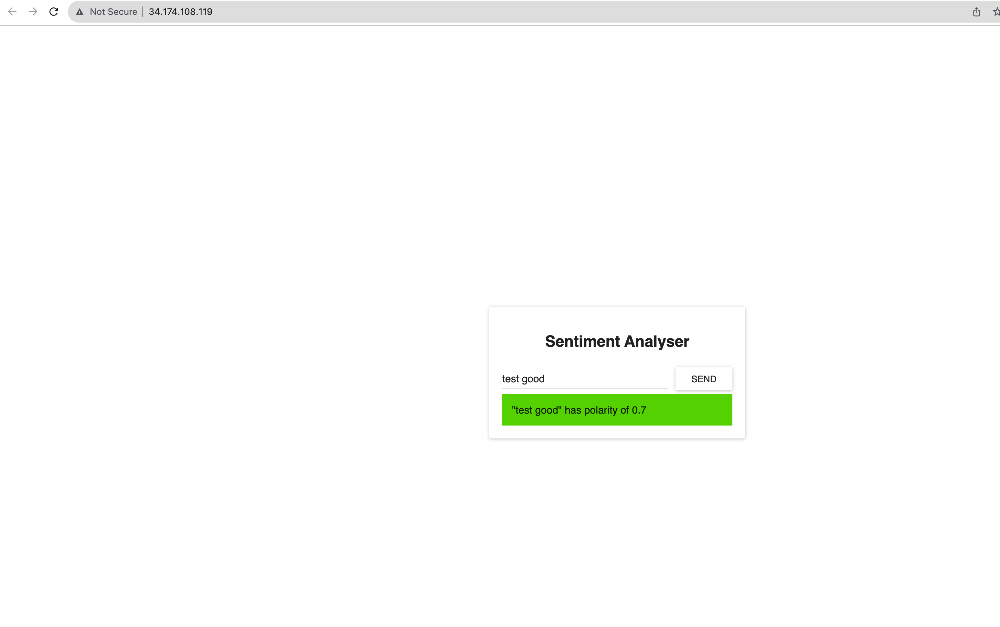
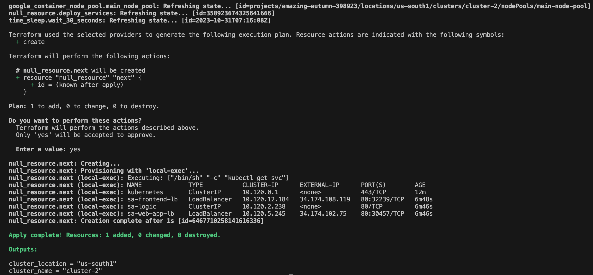
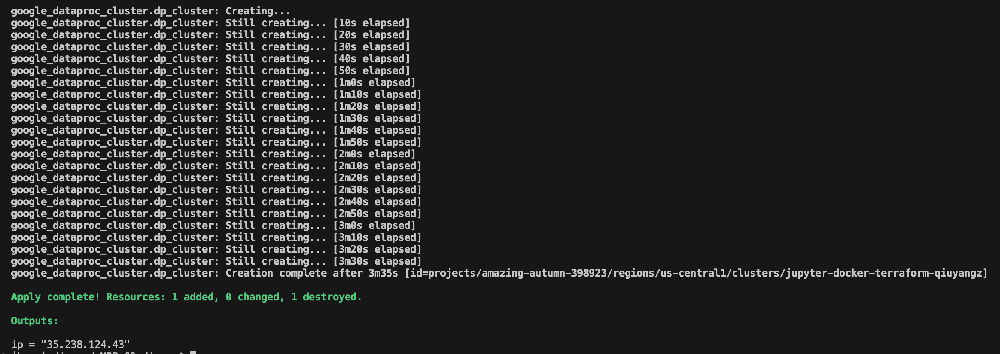
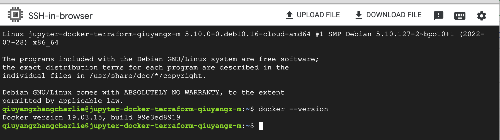

### Screenshots

### Q1 Important Debugging steps:
1. The essence of this question is to reserve a static ip address for web-app and modified its service file by adding `loadBalancerIP` field.
2. Then change the fetch in sa-frontend and insert that static ip of web-app into App.js using env variable.
3. Remeber to run `npm run build` and then `docker build` and `docker push` to update the sa-frontend image in dockerhub. This took me a long time since I forgot to run build at first. 
4. Another thing that I was stuck in was the static ip address as env variable. It should be `http://xxx.xx.xx.xx` not `https`. The `https` at first prevented me from fetching correctly from the web-app. 
5. In the main.tf, `kubectl apply` those deployment.yaml and service.yaml and do `kubectl get svc` using `local-exec`.
6. Initially, the ip address is pending. But if we added the `kubectl get svc` in the second apply, then it will get the correct ip address through `kubectl get svc`.

### Q2 Important Debugging steps:
1. The essence of this question is the `optional_components = ["DOCKER", "ANACONDA", "JUPYTER"]` part.
2. What took me a lot of time is the IAM roles setting. I tried to set the service account role to dataproc.worker in the script first but it always prevented me from creating dataproc clusters. It was finally created by me manually setting its role to dataproc.worker in the IAM board of the project and the cloud storage. 
3. To get the ip address, I checked a bunch of resources and finally found the master node was actually a compute instance (https://registry.terraform.io/providers/hashicorp/google/latest/docs/data-sources/compute_instance.html) that has a field named `network_interface`. So after the inital `terraform apply`, I got the name of the master node from the UI and added a `data resource` block. Then, in the output.tf, I can query the ip address of the master node by `data.google_compute_instance.master.network_interface.0.access_config.0.nat_ip`
4. To run `docker --version`, I went to the deployed dataproc cluster, found the master node, SSH into the cloud shell, and ran the command. 